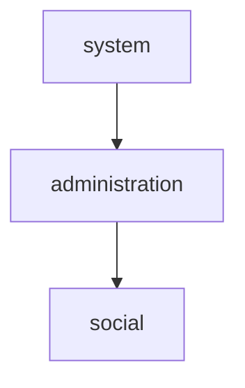
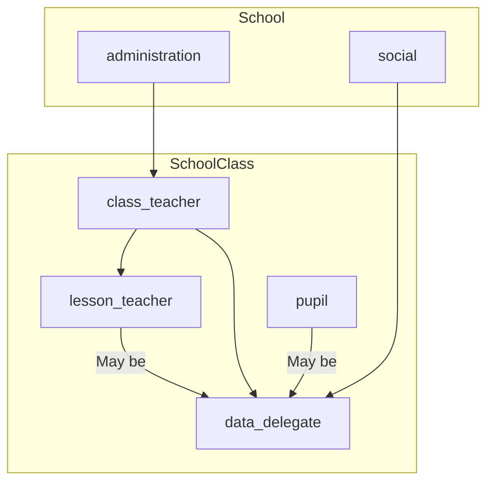

# Eversity Server Permissions convention

Internally, Eversity Server uses Oso for authorization.

There are several resources defined in server:

- User: Any user, registered in system
- SchoolClass: Represents school class.
- School: Represents whole school. Only one for one server instance. Every school class is a child of School.

## Vocabulary

- Requester - user, that requested allowance on given permission

- Target - resource (may be another User), that requester tries to get permission on

Roles relations diagrams are built using Mermaid Diagram Syntax. If one role (A) points to another (B), then if user has
role A, they are automatically granted (if not told otherwise) with role B.

## User roles in School

- `social`: Represents social teacher.
- `administration`: Represents school administration. Every user with this role is granted with all permissions, that
  user with `social` role is granted.
- `system`: Special user role, which is reserved for system administrators. Automatically granted **all** permissions in
  school.

### Roles relations in School

## User permissions in School

| Permission name               | Description                                                                                         | Required lowest role |
| ----------------------------- | --------------------------------------------------------------------------------------------------- |:--------------------:|
| `modify_system`               | Gives user ability to modify system internals, such as database locations, Schools.by address, etc. | `system`             |
| `read_whole_absence`          | Gives user permission to read school-wide absence data                                              | `social`             |
| `change_data`                 | Gives user permission to redact school's data, such as school titles, pupils data, etc.             | `administration`     |
| `read_all_profiles`           | Gives user permission to read **                                                                    |                      |
| all** user profiles in system | `social`                                                                                            |                      |

## User roles in SchoolClass

- `class_teacher`: Represents class's teacher.
- `lesson_teacher`: Teacher teaching the lesson at the time of the request (query).
- `data_delegate`: Special role that is given to users by decision of class teacher or system itself. May be granted to
  any user in system. Automatically (temporarily) granted to `lesson_teacher`, if their lesson is first (or zero lesson)
  .
- `pupil`: Represents class pupil.

### Roles relations in SchoolClass

### User permissions in SchoolClass

| Permission name | Description                                                                                                                       | Required lowest role                   |
| --------------- | --------------------------------------------------------------------------------------------------------------------------------- | -------------------------------------- |
| `edit_info`     | Gives user ability to redact information about given class (such as class title, shift, etc.).                                    | `class_teacher`                        |
| `edit_pupils`   | Gives user ability to redact information about pupils in given class (such as names) and ability to add/remove pupils from class. | `class_teacher`                        |
| `read`          | Gives user ability to read data about class (such as title, shift, class teacher ID, etc.), but not about it's members (pupils)   | Any user, that is registered in system |
| `read_members`  | Gives user ability to read data about class members (pupils)                                                                      | Any user, that has role in given class |
| `read_absence`  | Gives user ability to read class's absence data (but not edit it)                                                                 | `data_delegate`, `lesson_teacher`      |
| `post_absence`  | Gives user permission to post new (or edit) absence data                                                                          | `data_delegate`                        |

## User permissions outside of resources, defined earlier

| Permission name       | Resource type | Description                                                                             | Condition of having permission                                                                                                                                         |
| --------------------- | ------------- | --------------------------------------------------------------------------------------- | ---------------------------------------------------------------------------------------------------------------------------------------------------------------------- |
| `read`                | `User`        | Gives requester access to profile of target user                                        | Same target user as requester; `read_members` permission in SchoolClass (in case, if target user is a member of SchoolClass); `read_all_profiles` permission in School |
| `invalidate_tokens`   | `User`        | Gives requester permission to invalidate target user access tokens                      | Same target user as requester; `modify_system` permission in School                                                                                                    |
| `read_tokens`         | `User`        | Gives requester permission to read information about valid issued tokens of target user | Same target user as requester; `modify_system` permission in School                                                                                                    |
| `read_integrations`   | `User`        | Gives requester permission to read target user integrations                             | Same target user as requester; `modify_system` permission in School                                                                                                    |
| `delete_integrations` | `User`        | Gives requester permission to delete permissions                                        | Same target user as requester; `modify_system` permission in School                                                                                                    |
| `create_integrations` | `User`        | Gives requester permission to create new integrations                                   | Same target user as requester                                                                                                                                          |
